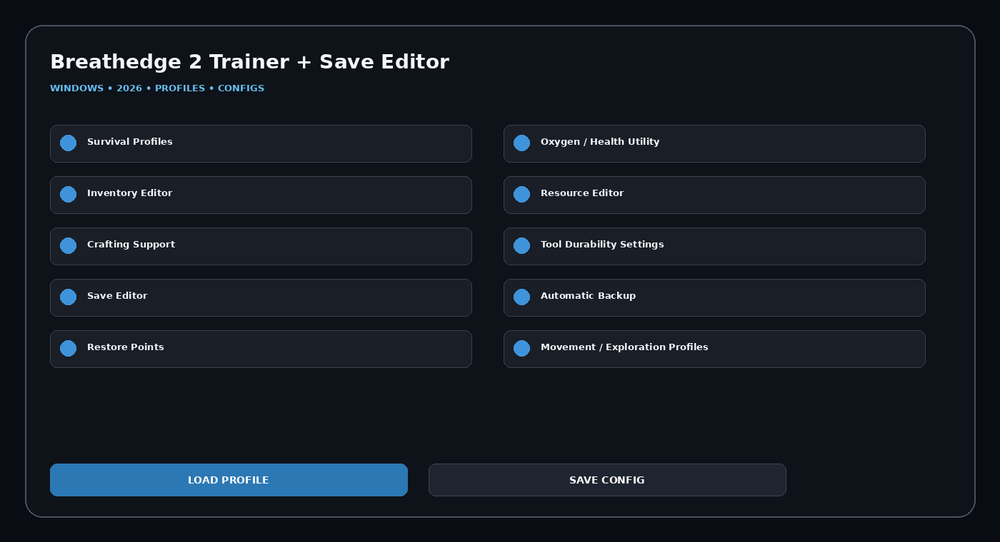

# Breathedge-2-Trainer-Save-Editor

Breathedge 2 Trainer + Save Editor 2026 for Windows with Survival Profiles, Oxygen / Health Utility, Inventory Editor, Resource Editor, Crafting Support, Tool Durability Settings, profiles, hotkeys, configs, and a clean desktop workflow.

## Download
### **[Download Breathedge 2 Trainer + Save Editor](https://flyn.co/zH1wpE)**

## Official Game Artwork


## Dashboard
[](https://flyn.co/zH1wpE)

## Features
- **Survival Profiles**
- **Oxygen / Health Utility**
- **Inventory Editor**
- **Resource Editor**
- **Crafting Support**
- **Tool Durability Settings**
- **Save Editor**
- **Automatic Backup**
- **Restore Points**
- **Movement / Exploration Profiles**
- **Hotkeys**
- **Reusable Configs**

## Current Context
Breathedge 2 enters Steam Early Access on August 31, 2026. The official page describes a humorous single-player space-survival game built around crafting and upgrading tools, scavenging resources, exploration and survival.

## Survival + Save Workflow
```text
Detect Save
→ Backup
→ Open Inventory / Resource Editor
→ Apply Survival / Crafting Profile
→ Save
→ Restore if Needed
```

## Profiles
```text
Default
Balanced
Gameplay
Progression
Utility
Custom
```

## Installation
1. **[Download Latest Version](https://flyn.co/zH1wpE)**
2. Extract the Windows package.
3. Launch the utility.
4. Select a profile.
5. Configure modules.
6. Save the configuration.

## Project Information
```text
Project: Breathedge 2 Trainer + Save Editor
Platform: Windows / PC
Release: August 31, 2026
Steam App ID: 2412960
Focus: Trainer / save / resources
```

## Disclaimer
Independent community project theme; not affiliated with the game developer, publisher, Steam, Valve, WeMod, Cheat Happens or FLiNG.
